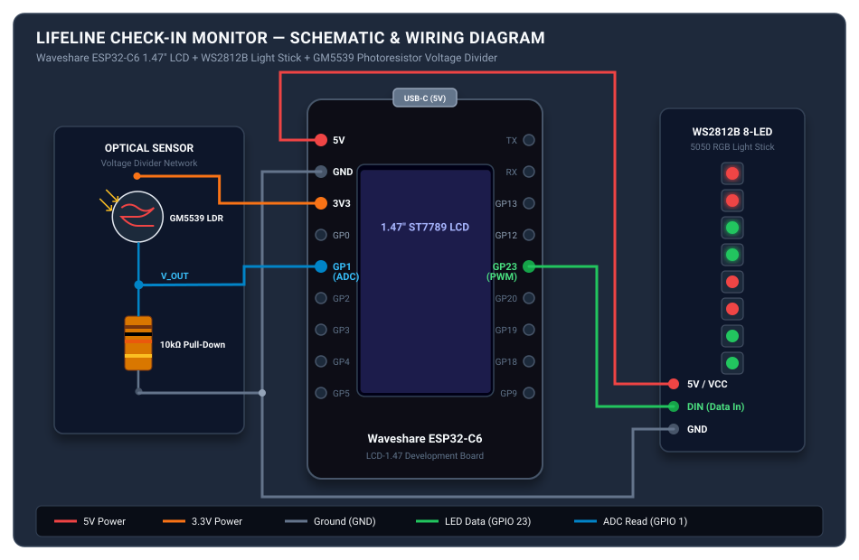

# Lifeline Check-In Monitor (ESP32-C6)

A compact safety-check reminder built for a Philips Lifeline wall-check device. This project uses an ESP32-C6 with an integrated LCD, a light sensor pointed at the Lifeline indicator LED, and a small LED strip to provide a visible daily reminder, detect a successful check-in, and log the event locally.

The device is intended as a non-invasive companion for a daily check-in routine and is designed to sit over the existing Lifeline unit without modifying the medical device itself.

This project was created for a parent living in an independent senior care facility. Each morning, the device reminds her to click the Lifeline button. If she forgets, the staff follow their normal daily check-in protocol and reach out to her to make sure she is okay. The local log is primarily for my own tracking and review, while the main purpose of the device is to provide a simple visual reminder that supports memory and daily routine without adding complexity.

For personal monitoring, the device’s local web interface is available on the device’s IP address on the local network at port 80. For example, if the board is assigned 192.168.1.55, the dashboard can be opened by visiting http://192.168.1.55/ and the log endpoint is http://192.168.1.55/log. This is intended for my own review of daily check-in status and not as a staff-facing system.

## Features

- Daily reminder state at a configured time (currently set for 5:00 AM)
- Optical detection of the Lifeline confirmation flash using a GM5539 photoresistor
- Visual confirmation with a green success state and an on-screen status update
- Wi-Fi connection and NTP time synchronization
- Local success logging to LittleFS
- Lightweight local web dashboard with a log endpoint
- 3D-printable enclosure concept for mounting over the Lifeline housing

## Demo

A short working demo video will be added here once the device is filmed in its final mounted configuration.

## Current project status

This repository is a working prototype and is still evolving. The current implementation includes:

- Wi-Fi connection and backup SSID fallback
- Daily reset and alarm scheduling
- Sensor polling and threshold detection
- LED animation states for idle, alarm, and success
- LVGL-based status display
- Local log file persistence and simple web access

## Bill of Materials (BOM)

| Component | Description | Notes / Link |
| --- | --- | --- |
| Microcontroller / display | Waveshare ESP32-C6 1.47" display dev board | Main controller with onboard LCD and USB-C port. [Amazon](https://www.amazon.com/dp/B0F48GJD19) |
| Light sensor | 5 mm GM5539 LDR photoresistor | Used to detect the Lifeline indicator flash without modifying the device. [Amazon](https://www.amazon.com/dp/B01N7V536K) |
| Divider resistor | 10 kΩ resistor | Pairs with the photoresistor for an analog voltage divider. |
| Status LEDs | WS2812B 8-pixel RGB LED strip | Provides visible reminder and success indication. [Amazon](https://www.amazon.com/dp/B0D7CC469B) |
| External power port | USB-C female to 4-pin terminal cable | Optional cleaned-up external port. This was tested with the product linked here, but a 6-pin version is preferred for cleaner USB-C power handling. [Amazon](https://www.amazon.com/dp/B0D7CN4BTV) |
| Internal USB connector | USB-C 24-pin male plug solder module | Mates to the board internally. A 6-pin USB-C breakout is often cleaner and more reliable for power delivery. [Amazon](https://www.amazon.com/dp/B09WCQKSW1) |
| Hardware | M2 / M3 brass heat-set inserts and machine screws | Used for mounting the board and securing the enclosure. [Amazon](https://www.amazon.com/dp/B0FH4JQ3VB) |
| Enclosure | 3D-printed PLA or PETG housing | Custom mount designed to fit over the Lifeline housing. |

## Hardware overview

### Wiring & pinout



### Recommended hardware

- Waveshare ESP32-C6 1.47-inch display dev board
- GM5539 photoresistor or similar LDR
- 10 kΩ resistor for the analog divider
- WS2812B 8-pixel RGB LED strip
- USB-C connection for power and programming
- Optional external USB port for clean enclosure integration

### Wiring summary

| Peripheral | ESP32-C6 pin | Notes |
| --- | --- | --- |
| NeoPixel data | GPIO 23 | WS2812B DIN |
| NeoPixel power | 5V / VBUS | LED strip supply |
| NeoPixel ground | GND | Common ground |
| Photoresistor | 3.3V | Sensor reference rail |
| Photoresistor ADC node | GPIO 1 | Reads analog voltage from divider |
| Divider resistor | GND / GPIO 1 | Forms voltage divider for light detection |

The pin configuration is defined in include/config.h.

## Important USB-C note

The external USB-C pigtail used for a clean panel connection commonly only exposes VBUS, GND, D+, and D-. That wiring does not include the required CC pull-down resistors for USB-C power negotiation.

> A 6-pin USB-C breakout or cable is preferred when possible because it includes the proper CC1/CC2 pull-down wiring needed for more reliable USB-C power delivery and safer operation with USB-C power sources.

For reliable power delivery:

- Use a USB-A to USB-C cable when powering from a standard USB wall adapter
- If direct USB-C to USB-C power is required, use a 6-pin USB-C breakout with proper 5.1 kΩ pull-downs on CC1/CC2, or add those resistors externally

## Enclosure and assembly

The STL files are located in the stl folder.

Recommended print settings:

- Material: PLA or PETG
- Layer height: 0.20 mm
- Infill: 15–20%
- Build plate: textured PEI recommended for a cleaner front finish

Assembly notes:

1. Mount the ESP32 display board in the enclosure.
2. Route the photoresistor so it points directly at the Lifeline indicator LED.
3. Block ambient room light around the sensor to reduce false positives.
4. Route power and data wiring cleanly through the enclosure.
5. Confirm the sensor sees the indicator flash in the intended operating environment.

## Software setup

This project is built with PlatformIO in Visual Studio Code using the Arduino framework and LVGL.

### Required dependencies

The project uses the following libraries in platformio.ini:

- lvgl/lvgl@8.4.0
- adafruit/Adafruit NeoPixel@^1.12.3

### Configuration

1. Clone the repository.
2. Open the folder in VS Code with PlatformIO installed.
3. Edit include/config.h to set your Wi‑Fi credentials and time settings.
4. Build and upload the firmware to the ESP32-C6.

Example settings in include/config.h include:

- WIFI_SSID
- WIFI_PASSWORD
- WIFI_BACKUP_SSID
- WIFI_BACKUP_PASSWORD
- NTP_TIMEZONE
- NTP_SERVER_1
- NTP_SERVER_2
- ALARM_HOUR and ALARM_MINUTE
- sensor tuning values such as SENSOR_TRIGGER_DELTA and SENSOR_DEBOUNCE_MS

Important: do not commit real Wi‑Fi credentials to a public repository. Keep this file local or use environment-specific overrides before publishing.

## Build and upload

From the project root:

1. Open the project in VS Code
2. Ensure the PlatformIO extension is installed
3. Select the ESP32-C6 target
4. Build the project
5. Upload to the connected board
6. Watch the serial monitor for setup and calibration output

## Project structure

```text
.
├── assets/                 # photos, diagrams, related media
├── include/                # project headers and configuration
│   ├── app_state.h
│   ├── config.h            # Wi-Fi, time, and device tuning
│   ├── event_log.h
│   ├── led_status.h
│   ├── lv_conf.h
│   ├── sensor_monitor.h
│   ├── sensors.h
│   ├── ui_status.h
│   └── web_dashboard.h
├── src/                    # firmware implementation
│   ├── app_state.cpp
│   ├── Display_ST7789.cpp
│   ├── Display_ST7789.h
│   ├── event_log.cpp
│   ├── led_status.cpp
│   ├── LVGL_Driver.cpp
│   ├── LVGL_Driver.h
│   ├── main.cpp
│   ├── sensor_monitor.cpp
│   ├── sensors.cpp
│   ├── ui_status.cpp
│   └── web_dashboard.cpp
├── stl/                    # 3D-printable enclosure files
├── README.md
├── platformio.ini
└── .gitignore
```

## How it works

The firmware follows a simple daily safety-check flow:

1. The device connects to Wi‑Fi and syncs time using NTP.
2. The app state starts in IDLE.
3. At the configured alarm time, the system enters the ALARM_ACTIVE state.
4. The LED strip begins a visible reminder and the LCD prompts the user to click the check-in button.
5. The photoresistor samples the Lifeline indicator LED and looks for the expected flash pattern.
6. If the flash is detected in the correct state, the system enters SUCCESS and records the event.
7. The device prevents duplicate success entries for the same day until reset at midnight.

## Sensor tuning and calibration

The photoresistor logic is controlled by values in include/config.h. The main tuning values are:

- SENSOR_SAMPLE_INTERVAL_MS
- SENSOR_BASELINE_WINDOW
- SENSOR_WARMUP_SAMPLES
- SENSOR_TRIGGER_DELTA
- SENSOR_MIN_ABSOLUTE
- SENSOR_DEBOUNCE_MS

These values affect how sensitive the detector is to the Lifeline LED flash. In practice, the correct threshold depends on:

- room lighting
- sensor distance from the LED
- exact LED brightness on the Lifeline unit
- enclosure light leakage

It may be necessary to adjust these values for reliable operation in a different room or mounting position.

## Local dashboard

The device includes a lightweight local web server that exposes a simple dashboard and a log viewer on the local network:

- http://DEVICE_IP/ : basic status page
- http://DEVICE_IP/log : raw success log contents

This is intended for personal review of daily check-in history and can be accessed from any device on the same local Wi‑Fi network. The board listens on port 80, so the URL is simply the device IP with :80 implied in the browser.

Example:

- http://192.168.1.55/
- http://192.168.1.55/log

This is not intended as a public-facing service and is not meant for staff access at the facility.

## Troubleshooting

### Wi‑Fi does not connect

- Verify SSID and password in include/config.h
- Confirm the board is within range of the network
- Check the serial output for connection attempts

### Alarm does not trigger

- Confirm the timezone and time sync are working
- Check the ALARM_HOUR and ALARM_MINUTE values
- Inspect the app state logic in src/app_state.cpp

### Sensor never detects the press

- Check sensor alignment over the Lifeline indicator LED
- Reduce ambient light around the sensor
- Lower or raise the trigger thresholds in include/config.h
- Confirm the ADC input is reading a measurable change on flash

### Success log is empty

- Verify the device reaches the ALARM_ACTIVE state
- Confirm the sensor sees the expected flash
- Ensure the board has enough free space for LittleFS

## Safety and usage notes

This project is a prototype and should be treated as a personal assistance device, not a medical device.

- It is intended to support a daily reminder flow, not replace formal medical alert services
- The optical sensor depends on consistent mounting and room conditions
- The device should be tested in place before relying on it in a real care setting
